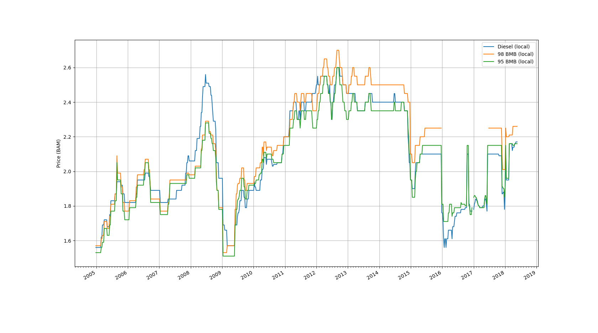
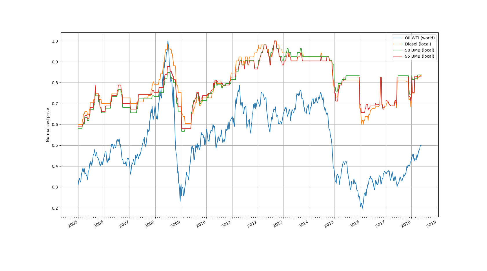

# bih-oil-prices

This repository contains [dataset](data.csv) of historical prices of oil/fuel in BiH, from 2015 to mid 2018. The dataset also contains the WTI oil price on the same date range. Source of the data is [IRU - World Road Transport Organisation](https://www.iru.org/) and [FRED](https://fred.stlouisfed.org/).

Some visualisaations have been done on the dataset. Namely...

## Local price changes, 2015-mid-2018

## Normalized price changes, World price vs Local price, 2015-mid-2018

